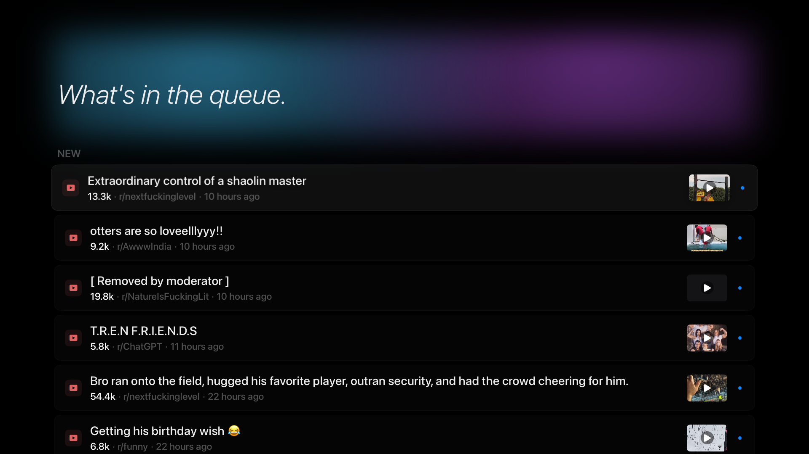

<p align="center">
  
</p>

<h1 align="center">Upvote TV</h1>

<p align="center">
  A personal Apple TV app that turns a shared iPhone-curated queue into a cozy couch viewing experience.
</p>

<p align="center">
  
  
  
  
  
</p>

---


## Why

Throughout the day I collect content I want to watch later with my wife on the TV. Reddit posts, YouTube videos, occasional oddities. Apple TV doesn't have a good way to unify a cross-source queue, and browsing Reddit or YouTube on the TV with the remote kills the lean-back experience.

Upvote TV fixes that. Anything shared from either of our iPhones via the system share sheet lands in a shared queue. The Apple TV app reads that queue, resolves titles and thumbnails from public endpoints, and presents everything as a polished Apple TV native interface.

No Reddit account login, no OAuth, no developer approval queue. Just share and watch.

## How It Works

```
iPhone (anyone in the household)
  ↓ Share Sheet → Upvote TV Share Extension
  ↓
GitHub Gist / queue.json
  ↓
Apple TV App
  ↓ resolves metadata from:
  ↓   reddit.com/comments/{id}.json
  ↓   youtube.com/oembed
  ↓
Polished card list, full-screen detail views
```

Three Xcode targets make this go: the tvOS app (the player), a small iOS companion app, and an iOS Share Extension that registers with the share sheet. A `Shared/` Swift folder holds the queue-client code used by all three.

## What It Looks Like



A single full-width column of soft cards under an ambient gradient header. Each card shows the post type icon, title, metadata, and an optional thumbnail. Selecting a card opens the content full-screen.

The header shows a curatorial tagline that's stable for the whole day and rotates at midnight — picked deterministically from a 73-line pool so the app doesn't say the same thing every night.

## Features

- **Two sources in v1:** Reddit posts and YouTube videos, each with a dedicated full-screen detail view.
- **Six post types** for Reddit content: video, image, gallery, text, YouTube-linked, and link. Plus direct YouTube queue items.
- **Shared household queue:** Any iPhone with the Upvote TV Share Extension installed contributes to the same queue.
- **Watched state tracking:** Viewed posts move to a "Watched" section; unwatched posts stay on top.
- **Smart watched rules:** Video marks at 50% playback, images/text/galleries after 2 seconds, YouTube only when you tap "Open in YouTube".
- **Remove from queue:** Long-press any item to drop it from the queue.
- **NSFW filtering:** Toggle via tvOS system Settings. Applies to Reddit items.
- **Offline resilience:** 24-hour metadata cache keeps the app usable when the network is unreliable, with a per-item stale badge.
- **Dark, minimal UI:** Designed for a TV viewing distance with large typography, generous whitespace, and a rotating tagline header.
- **Layered parallax icon + top shelf banner** that feel native on the Apple TV home screen.

## Tech Stack

| Layer | Technology |
|-------|-----------|
| Platforms | tvOS 18 (player), iOS 18 (companion + Share Extension) |
| Language | Swift |
| UI | SwiftUI |
| Video | AVKit |
| Persistence | SwiftData (tvOS) |
| Queue transport | GitHub Gist + fine-grained PAT |
| Capture | Native iOS Share Extension |
| Preferences | tvOS Settings.bundle |
| Architecture | MVVM + `ContentProvider` protocol; cross-target `Shared/` group |

## Project Structure

```
Upvote TV/
├── Shared/                         # Cross-target Swift (tvOS + iOS Mobile + Share)
│   ├── AppConfig.swift             # Constants (Gist API base, cache TTL)
│   ├── QueueItem.swift             # Queue entry model
│   ├── QueueSource.swift           # .reddit | .youtube
│   ├── GistQueueClient.swift       # HTTP GET/PATCH against api.github.com/gists
│   ├── SecretsLoader.swift         # Reads GistID + PAT from Secrets.plist
│   └── URLClassifier.swift         # URL → (id, source) extraction
├── Upvote TV/                      # tvOS target — the player
│   ├── Models/                     # Post, PostType, CachedPost, WatchedState…
│   ├── Providers/                  # ContentProvider, Mock, QueueContentProvider
│   ├── Services/                   # Metadata resolvers, cache, watched state
│   ├── ViewModels/                 # GalleryViewModel
│   ├── Views/                      # Browse, Detail, States
│   ├── Settings.bundle/            # NSFW toggle
│   └── Assets.xcassets/            # Icon layers + top shelf banner
├── Upvote TV Mobile/               # iOS companion app
│   └── ContentView.swift           # Explainer + Test Connection
├── Upvote TV Share/                # iOS Share Extension
│   ├── ShareViewController.swift   # UIKit host for the SwiftUI root
│   └── ShareRootView.swift         # Working → Success / Duplicate / Failure flow
└── Upvote TV.xcodeproj/
```

`Shared/` is registered in the project as a file-system-synchronized group referenced by **all three** targets, so any Swift file dropped in there is compiled into each app automatically.

## Architecture

The UI never talks to GitHub, Reddit, or YouTube directly. All data flows through a `ContentProvider` protocol:

```swift
protocol ContentProvider {
    func fetchPosts() async throws -> [Post]
}
```

- **MockContentProvider** returns sample data covering every post type. Used for SwiftUI previews and offline development.
- **QueueContentProvider** (v1 primary) reads `queue.json` from a GitHub Gist, then hydrates each queue item into a full `Post` using the appropriate metadata resolver (Reddit or YouTube). Results are cached in SwiftData for 24 hours.
- **RedditContentProvider** is deferred to Phase 7 — only revisited if Reddit API access is approved under the Responsible Builder Policy.

The app doesn't know or care which provider it's using.

## Building

```bash
# Build tvOS for Simulator
xcodebuild -scheme "Upvote TV" \
  -destination 'platform=tvOS Simulator,name=Apple TV' \
  build

# Build iOS companion for Simulator
xcodebuild -scheme "Upvote TV Mobile" \
  -destination 'platform=iOS Simulator,name=iPhone 16' \
  build

# Run tests
xcodebuild -scheme "Upvote TV" \
  -destination 'platform=tvOS Simulator,name=Apple TV' \
  test
```

### First-time setup

1. Follow [`docs/Gist-Setup.md`](docs/Gist-Setup.md) to create a secret Gist and a fine-grained GitHub PAT.
2. Copy `Upvote TV/Upvote TV/Secrets.example.plist` to `Upvote TV/Upvote TV/Secrets.plist`.
3. Paste your Gist ID and PAT into `Secrets.plist`. The file is gitignored. Both iOS targets symlink to this file, so one edit rotates the token for all three app targets.
4. Build & run. Without a valid `Secrets.plist` tvOS shows the Connection Error state.
5. For the iPhone share-sheet flow, see [`docs/iOS-App.md`](docs/iOS-App.md) — you'll build `Upvote TV Mobile` and install it on your iPhone via Xcode (or distribute via TestFlight for other household members).

### Testing the Queue Flow

To test the tvOS side without the iOS app, hand-edit the Gist on github.com:

1. Open your secret gist → Edit.
2. Replace the content of `queue.json` with a test payload (see below).
3. Save.
4. Launch Upvote TV. The list should populate within a second or two.

Sample `queue.json`:

```json
{
  "version": 1,
  "items": [
    {
      "id": "1abc2de",
      "url": "https://www.reddit.com/r/videos/comments/1abc2de/",
      "source": "reddit",
      "sharedAt": "2026-04-17T14:23:00Z"
    },
    {
      "id": "dQw4w9WgXcQ",
      "url": "https://www.youtube.com/watch?v=dQw4w9WgXcQ",
      "source": "youtube",
      "sharedAt": "2026-04-17T14:30:00Z"
    }
  ]
}
```

## Status

| Phase | Description | Status |
|-------|-------------|--------|
| 1 | Data models, providers, SwiftData setup | ✅ Done |
| 2 | Browse list UI with mock data | ✅ Done |
| 3 | Detail views (video, image, text, gallery, YouTube, link) | ✅ Done |
| 4 | Queue integration + metadata resolvers (Reddit + YouTube) | ✅ Done |
| 4.5 | Pivot queue transport from iCloud Drive → GitHub Gist (v3.1) | ✅ Done |
| 5 | iOS companion app + native Share Extension (v3.2) | ✅ Done |
| 6 | Polish: icon, top shelf, ambient-glow header, tagline rotation | ✅ Done |
| 7 | Reddit API (optional, requires Responsible Builder Policy approval) | ⏸ Deferred |

The original plan used the Reddit API as the primary data source. Reddit's 2025 Responsible Builder Policy introduced an unpredictable manual approval queue, so v3 of the PRD pivoted to the iPhone share-sheet model. Reddit API remains a possible future enhancement if access is granted.

## License

MIT. Do whatever you want with it.

## Credits

Built by [Justin Nikolaus](https://github.com/nikolausj1) with [Claude Code](https://claude.ai/claude-code).
